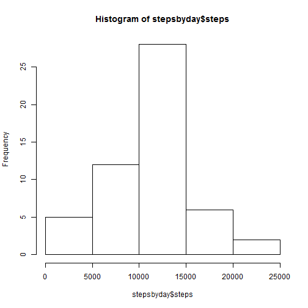
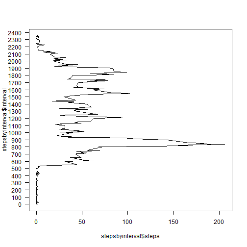
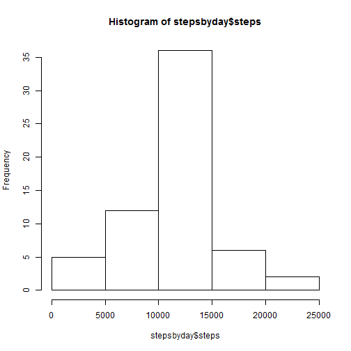
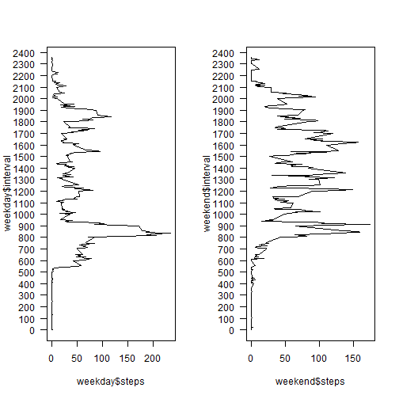

## Loading and preprocessing the data

```r
data <- read.csv("activity//activity.csv", stringsAsFactors = FALSE, na.strings = "NA")
library("lubridate")
library("sqldf")
```

## What is mean total number of steps taken per day?

```r
stepsbyday <- sqldf("select sum(steps) as steps from data group by date")
hist(stepsbyday$steps)
```

 

```r
sqldf("select avg(steps) from stepsbyday")
```

```
##   avg(steps)
## 1   10766.19
```

```r
median(stepsbyday$steps, na.rm = TRUE)
```

```
## [1] 10765
```


## What is the average daily activity pattern?

```r
stepsbyinterval <- sqldf("select interval, avg(steps) as steps from data group by interval")
plot(stepsbyinterval$steps, stepsbyinterval$interval, type = "l", lab=c(5,24,4), las =1)
```

 

```r
sqldf("select interval from stepsbyinterval where 
	steps = (select max(steps) from stepsbyinterval)")
```

```
##   interval
## 1      835
```

## Imputing missing values

```r
sqldf("select count(0) from data where steps is null")
```

```
##   count(0)
## 1     2304
```

```r
sqldf("select count(0), interval from data where steps is null group by interval")
```

```
##     count(0) interval
## 1          8        0
## 2          8        5
## 3          8       10
## 4          8       15
## 5          8       20
## 6          8       25
## 7          8       30
## 8          8       35
## 9          8       40
## 10         8       45
## 11         8       50
## 12         8       55
## 13         8      100
## 14         8      105
## 15         8      110
## 16         8      115
## 17         8      120
## 18         8      125
## 19         8      130
## 20         8      135
## 21         8      140
## 22         8      145
## 23         8      150
## 24         8      155
## 25         8      200
## 26         8      205
## 27         8      210
## 28         8      215
## 29         8      220
## 30         8      225
## 31         8      230
## 32         8      235
## 33         8      240
## 34         8      245
## 35         8      250
## 36         8      255
## 37         8      300
## 38         8      305
## 39         8      310
## 40         8      315
## 41         8      320
## 42         8      325
## 43         8      330
## 44         8      335
## 45         8      340
## 46         8      345
## 47         8      350
## 48         8      355
## 49         8      400
## 50         8      405
## 51         8      410
## 52         8      415
## 53         8      420
## 54         8      425
## 55         8      430
## 56         8      435
## 57         8      440
## 58         8      445
## 59         8      450
## 60         8      455
## 61         8      500
## 62         8      505
## 63         8      510
## 64         8      515
## 65         8      520
## 66         8      525
## 67         8      530
## 68         8      535
## 69         8      540
## 70         8      545
## 71         8      550
## 72         8      555
## 73         8      600
## 74         8      605
## 75         8      610
## 76         8      615
## 77         8      620
## 78         8      625
## 79         8      630
## 80         8      635
## 81         8      640
## 82         8      645
## 83         8      650
## 84         8      655
## 85         8      700
## 86         8      705
## 87         8      710
## 88         8      715
## 89         8      720
## 90         8      725
## 91         8      730
## 92         8      735
## 93         8      740
## 94         8      745
## 95         8      750
## 96         8      755
## 97         8      800
## 98         8      805
## 99         8      810
## 100        8      815
## 101        8      820
## 102        8      825
## 103        8      830
## 104        8      835
## 105        8      840
## 106        8      845
## 107        8      850
## 108        8      855
## 109        8      900
## 110        8      905
## 111        8      910
## 112        8      915
## 113        8      920
## 114        8      925
## 115        8      930
## 116        8      935
## 117        8      940
## 118        8      945
## 119        8      950
## 120        8      955
## 121        8     1000
## 122        8     1005
## 123        8     1010
## 124        8     1015
## 125        8     1020
## 126        8     1025
## 127        8     1030
## 128        8     1035
## 129        8     1040
## 130        8     1045
## 131        8     1050
## 132        8     1055
## 133        8     1100
## 134        8     1105
## 135        8     1110
## 136        8     1115
## 137        8     1120
## 138        8     1125
## 139        8     1130
## 140        8     1135
## 141        8     1140
## 142        8     1145
## 143        8     1150
## 144        8     1155
## 145        8     1200
## 146        8     1205
## 147        8     1210
## 148        8     1215
## 149        8     1220
## 150        8     1225
## 151        8     1230
## 152        8     1235
## 153        8     1240
## 154        8     1245
## 155        8     1250
## 156        8     1255
## 157        8     1300
## 158        8     1305
## 159        8     1310
## 160        8     1315
## 161        8     1320
## 162        8     1325
## 163        8     1330
## 164        8     1335
## 165        8     1340
## 166        8     1345
## 167        8     1350
## 168        8     1355
## 169        8     1400
## 170        8     1405
## 171        8     1410
## 172        8     1415
## 173        8     1420
## 174        8     1425
## 175        8     1430
## 176        8     1435
## 177        8     1440
## 178        8     1445
## 179        8     1450
## 180        8     1455
## 181        8     1500
## 182        8     1505
## 183        8     1510
## 184        8     1515
## 185        8     1520
## 186        8     1525
## 187        8     1530
## 188        8     1535
## 189        8     1540
## 190        8     1545
## 191        8     1550
## 192        8     1555
## 193        8     1600
## 194        8     1605
## 195        8     1610
## 196        8     1615
## 197        8     1620
## 198        8     1625
## 199        8     1630
## 200        8     1635
## 201        8     1640
## 202        8     1645
## 203        8     1650
## 204        8     1655
## 205        8     1700
## 206        8     1705
## 207        8     1710
## 208        8     1715
## 209        8     1720
## 210        8     1725
## 211        8     1730
## 212        8     1735
## 213        8     1740
## 214        8     1745
## 215        8     1750
## 216        8     1755
## 217        8     1800
## 218        8     1805
## 219        8     1810
## 220        8     1815
## 221        8     1820
## 222        8     1825
## 223        8     1830
## 224        8     1835
## 225        8     1840
## 226        8     1845
## 227        8     1850
## 228        8     1855
## 229        8     1900
## 230        8     1905
## 231        8     1910
## 232        8     1915
## 233        8     1920
## 234        8     1925
## 235        8     1930
## 236        8     1935
## 237        8     1940
## 238        8     1945
## 239        8     1950
## 240        8     1955
## 241        8     2000
## 242        8     2005
## 243        8     2010
## 244        8     2015
## 245        8     2020
## 246        8     2025
## 247        8     2030
## 248        8     2035
## 249        8     2040
## 250        8     2045
## 251        8     2050
## 252        8     2055
## 253        8     2100
## 254        8     2105
## 255        8     2110
## 256        8     2115
## 257        8     2120
## 258        8     2125
## 259        8     2130
## 260        8     2135
## 261        8     2140
## 262        8     2145
## 263        8     2150
## 264        8     2155
## 265        8     2200
## 266        8     2205
## 267        8     2210
## 268        8     2215
## 269        8     2220
## 270        8     2225
## 271        8     2230
## 272        8     2235
## 273        8     2240
## 274        8     2245
## 275        8     2250
## 276        8     2255
## 277        8     2300
## 278        8     2305
## 279        8     2310
## 280        8     2315
## 281        8     2320
## 282        8     2325
## 283        8     2330
## 284        8     2335
## 285        8     2340
## 286        8     2345
## 287        8     2350
## 288        8     2355
```

```r
sqldf("select count(0), date from data where steps is null group by date")
```

```
##   count(0)       date
## 1      288 2012-10-01
## 2      288 2012-10-08
## 3      288 2012-11-01
## 4      288 2012-11-04
## 5      288 2012-11-09
## 6      288 2012-11-10
## 7      288 2012-11-14
## 8      288 2012-11-30
```
###Missing data is uniformly distributed across each day and interval

```r
fillData <- sqldf("select * from stepsbyinterval left join (select distinct date from data where steps is null) d")
datafill <- sqldf("select * from data where not steps is null")
datafill <- sqldf(c("insert into datafill(steps, date, interval) select steps, date, interval from fillData", "select * from datafill"))
stepsbyday <- sqldf("select sum(steps) as steps from datafill group by date")
hist(stepsbyday$steps)
```

 

```r
sqldf("select avg(steps) from stepsbyday")
```

```
##   avg(steps)
## 1   10749.77
```

```r
median(stepsbyday$steps, na.rm = TRUE)
```

```
## [1] 10641
```


## Are there differences in activity patterns between weekdays and weekends?

```r
wdata <- transform(data, date = weekdays(ymd(date)))
wdata <- sqldf("select steps, case when date = 'Saturday' or date = 'Sunday' then 'Weekend' else 'Weekday' end as dayType, interval from wdata where not steps is null")
wdata <- sqldf("select avg(steps) as steps, dayType, interval from wdata group by dayType, interval")
weekend <- sqldf("select steps, interval from wdata where dayType = 'Weekend'")
weekday <- sqldf("select steps, interval from wdata where dayType = 'Weekday'")
par(mfrow=c(1,2))
plot(weekday$steps, weekday$interval, type = "l", lab=c(5,24,4), las =1)
plot(weekend$steps, weekend$interval, type = "l", lab=c(5,24,4), las =1)
```

 


